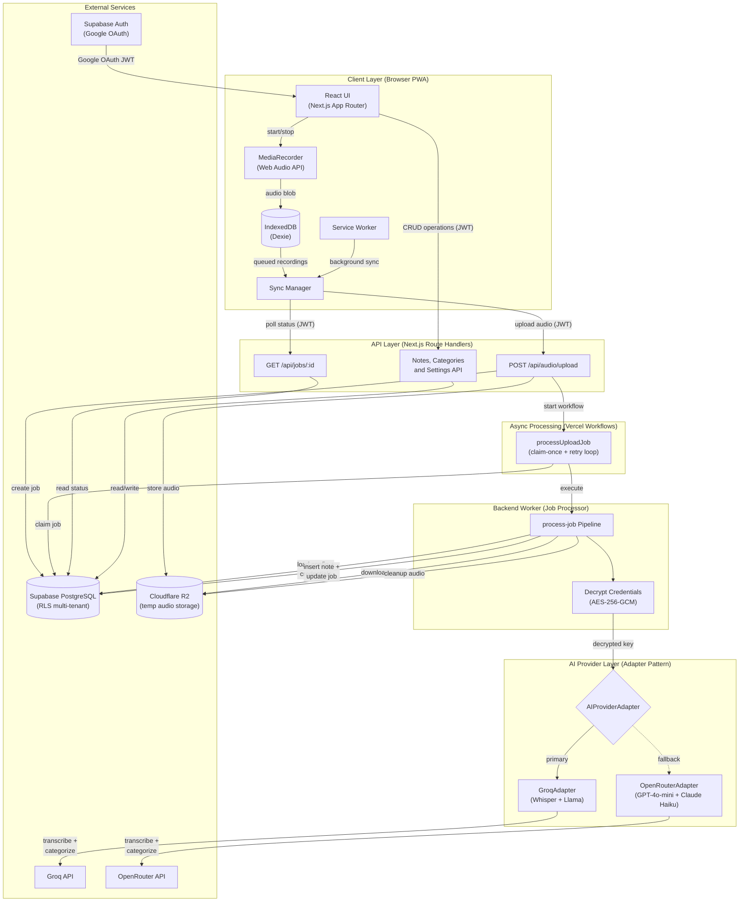
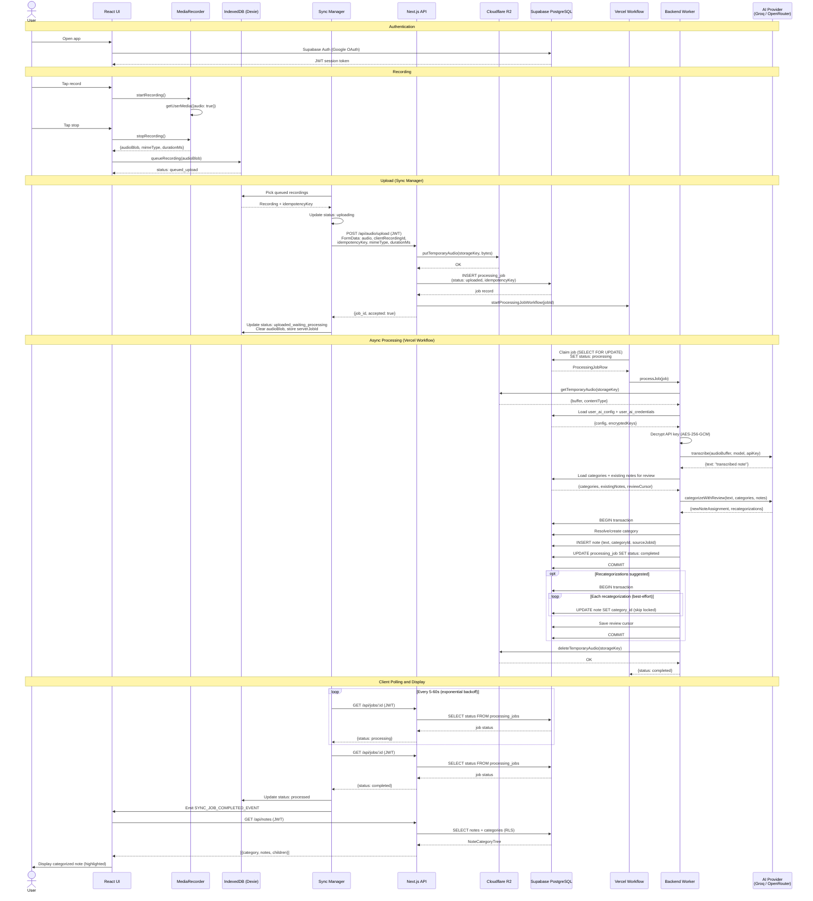

```mermaid
graph TB
    subgraph CLIENT["Client Layer (Browser PWA)"]
        UI["React UI<br/>(Next.js App Router)"]
        MR["MediaRecorder<br/>(Web Audio API)"]
        IDB[("IndexedDB<br/>(Dexie)")]
        SM["Sync Manager"]
        SW["Service Worker"]
    end

    subgraph API["API Layer (Next.js Route Handlers)"]
        UPLOAD["POST /api/audio/upload"]
        JOBS["GET /api/jobs/:id"]
        DATA_API["Notes, Categories<br/>and Settings API"]
    end

    subgraph WORKFLOW["Async Processing (Vercel Workflows)"]
        WF["processUploadJob<br/>(claim-once + retry loop)"]
    end

    subgraph WORKER["Backend Worker (Job Processor)"]
        PROC["process-job Pipeline"]
        DECRYPT["Decrypt Credentials<br/>(AES-256-GCM)"]
    end

    subgraph PROVIDERS["AI Provider Layer (Adapter Pattern)"]
        IFACE{"AIProviderAdapter"}
        GROQ["GroqAdapter<br/>(Whisper + Llama)"]
        OPENR["OpenRouterAdapter<br/>(GPT-4o-mini + Claude Haiku)"]
    end

    subgraph EXTERNAL["External Services"]
        SUPA[("Supabase PostgreSQL<br/>(RLS multi-tenant)")]
        R2[("Cloudflare R2<br/>(temp audio storage)")]
        SUPA_AUTH["Supabase Auth<br/>(Google OAuth)"]
        GROQ_API["Groq API"]
        OPENR_API["OpenRouter API"]
    end

    UI -- "start/stop" --> MR
    MR -- "audio blob" --> IDB
    IDB -- "queued recordings" --> SM
    SW -- "background sync" --> SM

    SUPA_AUTH -- "Google OAuth JWT" --> UI

    SM -- "upload audio (JWT)" --> UPLOAD
    SM -- "poll status (JWT)" --> JOBS
    UI -- "CRUD operations (JWT)" --> DATA_API

    UPLOAD -- "store audio" --> R2
    UPLOAD -- "create job" --> SUPA
    UPLOAD -- "start workflow" --> WF

    WF -- "claim job" --> SUPA
    WF -- "execute" --> PROC

    PROC -- "download audio" --> R2
    PROC -- "load config +<br/>credentials" --> SUPA
    PROC --> DECRYPT
    DECRYPT -- "decrypted key" --> IFACE
    IFACE -- "primary" --> GROQ
    IFACE -. "fallback" .-> OPENR
    GROQ -- "transcribe +<br/>categorize" --> GROQ_API
    OPENR -- "transcribe +<br/>categorize" --> OPENR_API

    PROC -- "insert note +<br/>update job" --> SUPA
    PROC -- "cleanup audio" --> R2

    JOBS -- "read status" --> SUPA
    DATA_API -- "read/write" --> SUPA
```

```mermaid
sequenceDiagram
    actor User
    participant UI as React UI
    participant MR as MediaRecorder
    participant IDB as IndexedDB (Dexie)
    participant SM as Sync Manager
    participant API as Next.js API
    participant R2 as Cloudflare R2
    participant DB as Supabase PostgreSQL
    participant WF as Vercel Workflow
    participant Worker as Backend Worker
    participant AI as AI Provider<br/>(Groq / OpenRouter)

    Note over User,AI: Authentication

    User->>UI: Open app
    UI->>DB: Supabase Auth (Google OAuth)
    DB-->>UI: JWT session token

    Note over User,AI: Recording

    User->>UI: Tap record
    UI->>MR: startRecording()
    MR->>MR: getUserMedia({audio: true})
    User->>UI: Tap stop
    UI->>MR: stopRecording()
    MR-->>UI: {audioBlob, mimeType, durationMs}
    UI->>IDB: queueRecording(audioBlob)
    IDB-->>UI: status: queued_upload

    Note over User,AI: Upload (Sync Manager)

    SM->>IDB: Pick queued recordings
    IDB-->>SM: Recording + idempotencyKey
    SM->>SM: Update status: uploading
    SM->>API: POST /api/audio/upload (JWT)<br/>FormData: audio, clientRecordingId,<br/>idempotencyKey, mimeType, durationMs
    API->>R2: putTemporaryAudio(storageKey, bytes)
    R2-->>API: OK
    API->>DB: INSERT processing_job<br/>(status: uploaded, idempotencyKey)
    DB-->>API: job record
    API->>WF: startProcessingJobWorkflow(jobId)
    API-->>SM: {job_id, accepted: true}
    SM->>IDB: Update status: uploaded_waiting_processing<br/>Clear audioBlob, store serverJobId

    Note over User,AI: Async Processing (Vercel Workflow)

    WF->>DB: Claim job (SELECT FOR UPDATE)<br/>SET status: processing
    DB-->>WF: ProcessingJobRow

    WF->>Worker: processJob(job)
    Worker->>R2: getTemporaryAudio(storageKey)
    R2-->>Worker: {buffer, contentType}
    Worker->>DB: Load user_ai_config + user_ai_credentials
    DB-->>Worker: {config, encryptedKeys}
    Worker->>Worker: Decrypt API key (AES-256-GCM)

    Worker->>AI: transcribe(audioBuffer, model, apiKey)
    AI-->>Worker: {text: "transcribed note"}

    Worker->>DB: Load categories + existing notes for review
    DB-->>Worker: {categories, existingNotes, reviewCursor}
    Worker->>AI: categorizeWithReview(text, categories, notes)
    AI-->>Worker: {newNoteAssignment, recategorizations}

    Worker->>DB: BEGIN transaction
    Worker->>DB: Resolve/create category
    Worker->>DB: INSERT note (text, categoryId, sourceJobId)
    Worker->>DB: UPDATE processing_job SET status: completed
    Worker->>DB: COMMIT

    opt Recategorizations suggested
        Worker->>DB: BEGIN transaction
        loop Each recategorization (best-effort)
            Worker->>DB: UPDATE note SET category_id (skip locked)
        end
        Worker->>DB: Save review cursor
        Worker->>DB: COMMIT
    end

    Worker->>R2: deleteTemporaryAudio(storageKey)
    R2-->>Worker: OK
    Worker-->>WF: {status: completed}

    Note over User,AI: Client Polling and Display

    loop Every 5-60s (exponential backoff)
        SM->>API: GET /api/jobs/:id (JWT)
        API->>DB: SELECT status FROM processing_jobs
        DB-->>API: job status
        API-->>SM: {status: processing}
    end

    SM->>API: GET /api/jobs/:id (JWT)
    API->>DB: SELECT status FROM processing_jobs
    DB-->>API: job status
    API-->>SM: {status: completed}
    SM->>IDB: Update status: processed
    SM->>UI: Emit SYNC_JOB_COMPLETED_EVENT

    UI->>API: GET /api/notes (JWT)
    API->>DB: SELECT notes + categories (RLS)
    DB-->>API: NoteCategoryTree
    API-->>UI: [{category, notes, children}]
    UI->>User: Display categorized note (highlighted)
```
