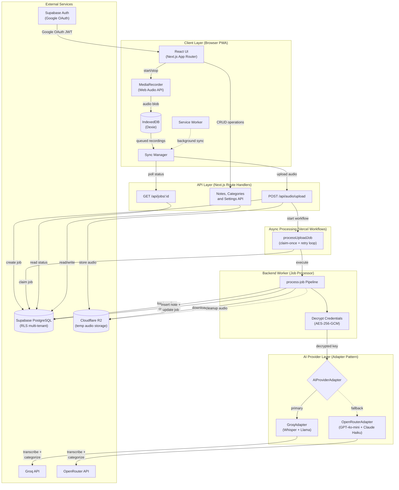

```mermaid
graph TB
    subgraph CLIENT["Client Layer (Browser PWA)"]
        UI["React UI<br/>(Next.js App Router)"]
        MR["MediaRecorder<br/>(Web Audio API)"]
        IDB[("IndexedDB<br/>(Dexie)")]
        SM["Sync Manager"]
        SW["Service Worker"]
    end

    subgraph API["API Layer (Next.js Route Handlers)"]
        UPLOAD["POST /api/audio/upload"]
        JOBS["GET /api/jobs/:id"]
        DATA_API["Notes, Categories<br/>and Settings API"]
    end

    subgraph WORKFLOW["Async Processing (Vercel Workflows)"]
        WF["processUploadJob<br/>(claim-once + retry loop)"]
    end

    subgraph WORKER["Backend Worker (Job Processor)"]
        PROC["process-job Pipeline"]
        DECRYPT["Decrypt Credentials<br/>(AES-256-GCM)"]
    end

    subgraph PROVIDERS["AI Provider Layer (Adapter Pattern)"]
        IFACE{"AIProviderAdapter"}
        GROQ["GroqAdapter<br/>(Whisper + Llama)"]
        OPENR["OpenRouterAdapter<br/>(GPT-4o-mini + Claude Haiku)"]
    end

    subgraph EXTERNAL["External Services"]
        SUPA[("Supabase PostgreSQL<br/>(RLS multi-tenant)")]
        R2[("Cloudflare R2<br/>(temp audio storage)")]
        SUPA_AUTH["Supabase Auth<br/>(Google OAuth)"]
        GROQ_API["Groq API"]
        OPENR_API["OpenRouter API"]
    end

    UI -- "start/stop" --> MR
    MR -- "audio blob" --> IDB
    IDB -- "queued recordings" --> SM
    SW -. "background sync" .-> SM

    SUPA_AUTH -- "Google OAuth JWT" --> UI

    SM -- "upload audio" --> UPLOAD
    SM -- "poll status" --> JOBS
    UI -- "CRUD operations" --> DATA_API

    UPLOAD -- "store audio" --> R2
    UPLOAD -- "create job" --> SUPA
    UPLOAD -- "start workflow" --> WF

    WF -- "claim job" --> SUPA
    WF -- "execute" --> PROC

    PROC -- "download audio" --> R2
    PROC -- "load config +<br/>credentials" --> SUPA
    PROC --> DECRYPT
    DECRYPT -- "decrypted key" --> IFACE
    IFACE -- "primary" --> GROQ
    IFACE -. "fallback" .-> OPENR
    GROQ -- "transcribe +<br/>categorize" --> GROQ_API
    OPENR -- "transcribe +<br/>categorize" --> OPENR_API

    PROC -- "insert note +<br/>update job" --> SUPA
    PROC -. "cleanup audio" .-> R2

    JOBS -- "read status" --> SUPA
    DATA_API -- "read/write" --> SUPA
```
